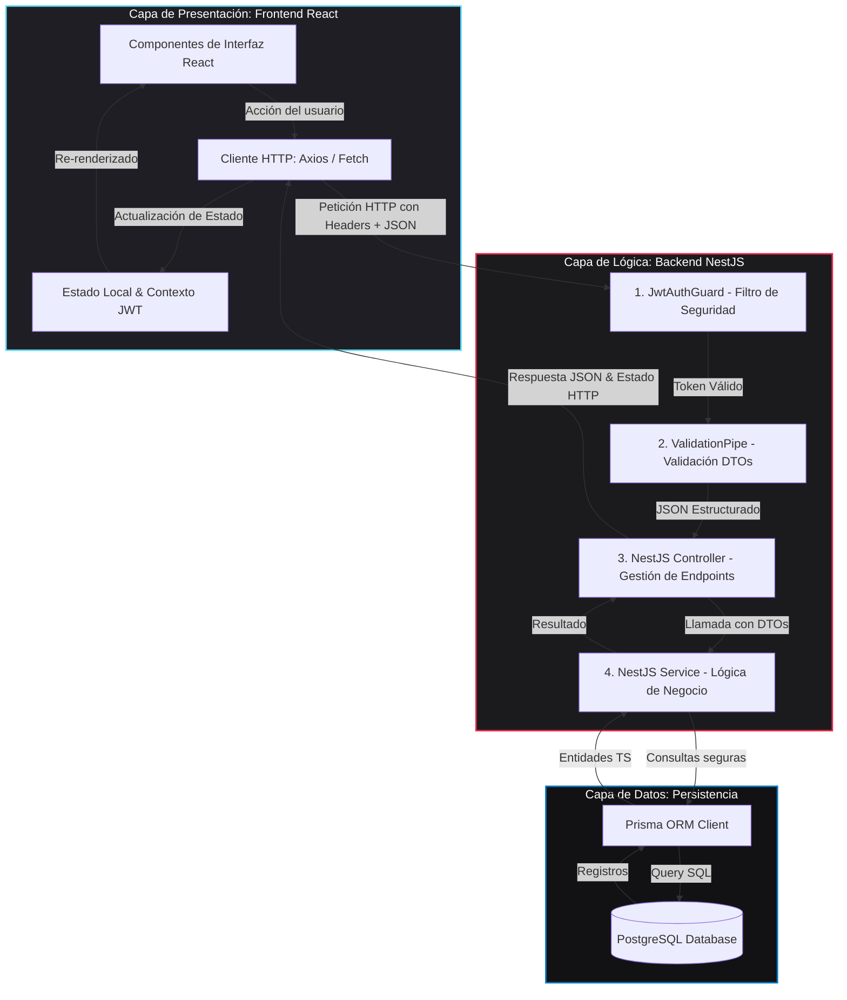

# 📊 Documentación de Conexiones, Arquitectura y Peticiones HTTP

Esta guía detalla la arquitectura de comunicación cliente-servidor y el flujo de peticiones HTTP para la aplicación de **Gestión de Tareas** (enunciado literal de la tarea académica) y la aplicación **Tindel** (tu proyecto real). 

Esta documentación técnica sirve de sustento teórico para tu entrega y explica detalladamente cómo interactúan las capas de **Frontend (React)**, **Backend (NestJS)** y la **Base de Datos (PostgreSQL/Prisma)**.

---

## 🏗️ 1. Arquitectura de Comunicación Cliente-Servidor

La arquitectura del sistema sigue el patrón clásico de **Arquitectura de Tres Capas**:

1. **Capa de Presentación (Frontend - React)**:
   - Corre en el cliente (navegador).
   - Administra la interfaz de usuario, captura eventos, gestiona el estado local (ej. tokens de sesión) y realiza peticiones asíncronas HTTP (mediante `Fetch API` o `Axios`) hacia el servidor.
2. **Capa de Negocio (Backend - NestJS)**:
   - Corre en un servidor Node.js (por defecto en `http://localhost:3000`).
   - Se organiza modularmente en **Controllers** (control de rutas y validación de DTOs), **Services** (lógica de negocio y reglas del sistema) y **Guards** (seguridad y control de acceso por tokens JWT).
3. **Capa de Datos (Base de Datos - PostgreSQL + Prisma ORM)**:
   - Almacena de forma persistente la información (usuarios, tareas, likes, chats).
   - Prisma actúa como el ORM de TypeScript, permitiendo consultas seguras y fuertemente tipadas sin escribir SQL crudo, garantizando las propiedades **ACID** en las transacciones.



---

## 🚦 2. Flujo de una Petición HTTP Paso a Paso

Cuando el cliente solicita realizar una acción (por ejemplo, dar un `LIKE` en Tindel o crear una nueva tarea en el Gestor de Tareas), la petición transita por los siguientes pasos clave:

1. **Despacho del Cliente (HTTP Request)**:
   - El cliente de React envía una solicitud HTTP (ej. `POST /interactions` o `POST /tasks`).
   - Si la ruta requiere protección, incluye en las cabeceras: `Authorization: Bearer <JWT_TOKEN>`.
   
2. **Seguridad (Guard / Middleware)**:
   - NestJS intercepta la petición a través del `@UseGuards(JwtAuthGuard)`.
   - Se decodifica y verifica la firma del JWT. Si es inválido o no existe, detiene el flujo y responde inmediatamente con un código `401 Unauthorized` y un JSON explicativo.

3. **Validación de Datos (Validation Pipe)**:
   - Si pasa la seguridad, el JSON del cuerpo de la petición se valida a nivel de controlador mediante el `ValidationPipe` global.
   - Si el formato del JSON incumple las reglas definidas en el DTO (como un campo obligatorio ausente o tipo de dato incorrecto), responde automáticamente con un código `400 Bad Request`.

4. **Controlador (Routing & Endpoint)**:
   - El controlador recibe el DTO completamente validado y mapeado como un objeto de TypeScript y delega la ejecución de la tarea al servicio correspondiente (ej. `tasksService.create()` o `interactionsService.create()`).

5. **Servicio (Reglas de Negocio & ORM)**:
   - El servicio ejecuta la lógica del sistema (ej. *"verificar que el usuario no se dé like a sí mismo"*, o *"calcular la fecha límite de la tarea"*).
   - Se comunica con Prisma (`this.prisma.task.create()`) para persistir o consultar datos.

6. **Persistencia (Base de Datos)**:
   - El ORM mapea los datos a sentencias SQL y los ejecuta de manera transaccional y ACID en PostgreSQL.
   
7. **Retorno de Respuesta (HTTP Response)**:
   - La base de datos responde a Prisma, Prisma al servicio, el servicio al controlador, y NestJS serializa la respuesta en formato JSON con su respectivo código de estado HTTP (ej. `201 Created` para POST, `200 OK` para GET/PUT/PATCH, `204 No Content` para DELETE) de vuelta al navegador.

---

## 📅 3. Especificación de Endpoints: Aplicación de Gestión de Tareas

En esta sección se detallan las peticiones que gestionan la información del sistema de **Tareas** según la solicitud formal del deber.

### 🔐 Autenticación
| Método | Endpoint | Descripción | Requiere Token | Código Exitoso |
|---|---|---|---|---|
| `POST` | `/auth/register` | Registro de un nuevo usuario | No | `201 Created` |
| `POST` | `/auth/login` | Inicio de sesión, retorna el JWT token | No | `201 Created` |

### 📝 Gestión de Tareas (CRUD)
| Método | Endpoint | Descripción | Requiere Token | Código Exitoso |
|---|---|---|---|---|
| `GET` | `/tasks` | Obtener todas las tareas del usuario | **Sí** (JWT) | `200 OK` |
| `GET` | `/tasks/:id` | Obtener los detalles de una tarea específica | **Sí** (JWT) | `200 OK` |
| `POST` | `/tasks` | Crear una nueva tarea en el sistema | **Sí** (JWT) | `201 Created` |
| `PUT` | `/tasks/:id` | Reemplazar completamente una tarea | **Sí** (JWT) | `200 OK` |
| `PATCH` | `/tasks/:id` | Cambiar el estado o un campo específico (ej: completar) | **Sí** (JWT) | `200 OK` |
| `DELETE` | `/tasks/:id` | Eliminar físicamente una tarea | **Sí** (JWT) | `200 OK` o `204` |

---

### 📥 Ejemplos de Payloads JSON (Gestión de Tareas)

#### 1. Iniciar Sesión (`POST /auth/login`)
- **Petición (Request Body):**
```json
{
  "email": "estudiante@uide.edu.ec",
  "password": "miPasswordSegura123"
}
```
- **Respuesta (Response Body - JSON, `201 Created`):**
```json
{
  "access_token": "eyJhbGciOiJIUzI1NiIsInR5cCI6IkpXVCJ9.eyJzdWIiOjEsImVtYWlsIjoiZXN0dWRpYW50ZUB1aWRlLmVkdS5lYyIsImlhdCI6MTcxNzIwNDgwMCwiZXhwIjoxNzE3MjQ4MDAwfQ.gQ...",
  "user": {
    "id": 1,
    "name": "Josué Albán",
    "email": "estudiante@uide.edu.ec"
  }
}
```

#### 2. Crear una Tarea (`POST /tasks`)
- **Headers:** `Authorization: Bearer <token_jwt>`
- **Petición (Request Body):**
```json
{
  "title": "Elaborar Diagrama de Conexiones",
  "description": "Diseñar el flujo frontend, backend y base de datos con las peticiones HTTP",
  "dueDate": "2026-06-05T23:59:59Z",
  "priority": "HIGH"
}
```
- **Respuesta (Response Body - JSON, `201 Created`):**
```json
{
  "id": 104,
  "title": "Elaborar Diagrama de Conexiones",
  "description": "Diseñar el flujo frontend, backend y base de datos con las peticiones HTTP",
  "dueDate": "2026-06-05T23:59:59.000Z",
  "priority": "HIGH",
  "status": "PENDING",
  "userId": 1,
  "createdAt": "2026-06-01T13:45:00.000Z",
  "updatedAt": "2026-06-01T13:45:00.000Z"
}
```

#### 3. Completar una Tarea (`PATCH /tasks/104`)
- **Headers:** `Authorization: Bearer <token_jwt>`
- **Petición (Request Body):**
```json
{
  "status": "COMPLETED"
}
```
- **Respuesta (Response Body - JSON, `200 OK`):**
```json
{
  "id": 104,
  "title": "Elaborar Diagrama de Conexiones",
  "description": "Diseñar el flujo frontend, backend y base de datos con las peticiones HTTP",
  "dueDate": "2026-06-05T23:59:59.000Z",
  "priority": "HIGH",
  "status": "COMPLETED",
  "userId": 1,
  "createdAt": "2026-06-01T13:45:00.000Z",
  "updatedAt": "2026-06-01T13:49:15.000Z"
}
```

#### 4. Intento de Acceso sin Token (`GET /tasks`)
- **Headers:** *(Sin Cabecera de Autorización)*
- **Respuesta (Response Body - JSON, `401 Unauthorized`):**
```json
{
  "message": "Unauthorized",
  "statusCode": 401
}
```

---

## 🔥 4. Especificación de Endpoints: Proyecto Real "Tindel"

A continuación se detallan las peticiones que gestionan la información para **Tindel** (Tu aplicación real en NestJS + Prisma), mostrando cómo se integran las interacciones y chats.

### 💖 Flujo de Negocio Completo (Tindel)
| Método | Endpoint | Descripción | Requiere Token | Código Exitoso |
|---|---|---|---|---|
| `POST` | `/auth/login` | Login del usuario, retorna JWT token | No | `201 Created` |
| `GET` | `/users` | Listado de usuarios activos (con fotos) | **Sí** (JWT) | `200 OK` |
| `PATCH` | `/users/:id` | Editar el perfil o biografía del usuario | **Sí** (JWT) | `200 OK` |
| `POST` | `/interactions` | Enviar Like, Superlike o Dislike | **Sí** (JWT) | `201 Created` |
| `GET` | `/matches/user/:userId` | Trae los Matches del usuario | **Sí** (JWT) | `200 OK` |
| `GET` | `/chats` | Ver listado de Chats y últimos mensajes | **Sí** (JWT) | `200 OK` |
| `POST` | `/messages` | Enviar un mensaje de chat | **Sí** (JWT) | `201 Created` |

---

### 📥 Ejemplos de Payloads JSON (Tindel)

#### 1. Registrar una Interacción de Like (`POST /interactions`)
*Si el usuario receptor (`toId`) ya dio LIKE al usuario emisor (`fromId`), esta petición dispara automáticamente un trigger en el servicio de NestJS que crea una entrada en las tablas `Match` y `Chat` de forma concurrente.*

- **Headers:** `Authorization: Bearer <token_jwt>`
- **Petición (Request Body):**
```json
{
  "type": "LIKE",
  "fromId": 1,
  "toId": 2
}
```
- **Respuesta (Response Body - JSON, `201 Created` - Con Match Creado en Cadena):**
```json
{
  "interaction": {
    "id": 501,
    "type": "LIKE",
    "fromId": 1,
    "toId": 2,
    "createdAt": "2026-06-01T13:46:12.000Z"
  },
  "isMatch": true,
  "matchDetails": {
    "matchId": 89,
    "chatId": 112,
    "message": "¡Felicidades! Se ha producido un Match recíproco y se ha abierto un chat privado."
  }
}
```

#### 2. Enviar un Mensaje en el Chat (`POST /messages`)
- **Headers:** `Authorization: Bearer <token_jwt>`
- **Petición (Request Body):**
```json
{
  "chatId": 112,
  "fromId": 1,
  "content": "¡Hola! He visto que nos gusta la misma tecnología. ¿Qué tal el proyecto?"
}
```
- **Respuesta (Response Body - JSON, `201 Created`):**
```json
{
  "id": 2049,
  "chatId": 112,
  "fromId": 1,
  "content": "¡Hola! He visto que nos gusta la misma tecnología. ¿Qué tal el proyecto?",
  "createdAt": "2026-06-01T13:47:05.000Z"
}
```

---

## 🛠️ 5. Códigos de Respuesta HTTP y su Significado

Nuestra API implementa códigos semánticos estándar de HTTP para la comunicación de estados:

- **`200 OK`**: Petición exitosa. Utilizado para consultas (`GET`), modificaciones completas (`PUT`) o modificaciones parciales (`PATCH`).
- **`201 Created`**: Petición exitosa que resultó en la creación de un recurso (ej: `POST` de un usuario, tarea, interacción o mensaje).
- **`204 No Content`**: Petición exitosa pero no retorna ningún contenido en el body (ideal para `DELETE` exitosos).
- **`400 Bad Request`**: Datos de entrada inválidos. La validación del DTO en NestJS falló (ej: password muy corta, email con formato incorrecto, o campos faltantes).
- **`401 Unauthorized`**: El usuario no ha iniciado sesión o el token JWT suministrado en la cabecera `Authorization` no es válido o ya expiró.
- **`403 Forbidden`**: El usuario está autenticado pero no tiene los privilegios o permisos necesarios para acceder a ese recurso específico (ej: intentar borrar un match ajeno).
- **`404 Not Found`**: El recurso solicitado (una tarea, usuario o interacción específica por ID) no existe en la base de datos.
- **`409 Conflict`**: Conflicto de estado. Por ejemplo, al intentar registrar un email que ya está en uso, o al intentar dar un Like a uno mismo.
